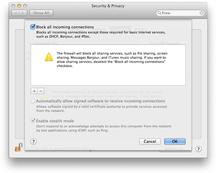

=====================
This code is obsolete
=====================

This was handy in its time, but after upgrading to a machine that can run a
bunch of VMs simultaneously without getting slow, I’m finding it easier to
keep a Linux VM running all the time on VMware’s NAT subnet, and ``ssh -R``
to that. `ttylinux <https://github.com/djerome/ttylinux>`__ is especially
handy for this.

If anyone is interested in doing anything with this code, I have a few
notes:

 - When I wrote this, I knew about `vmrun <http://www.vmware.com/support/developer/vix-api/vix112_vmrun_command.pdf>`__,
   but didn’t realize that the VIX API was available on the mac in ``VMware
   Fusion.app/Contents/Public/vix-perl.tar.gz``. There are header files and
   a shared library in that package. If you interface that with Python, you
   can create a VIX connection to the VM and issue many commands on that
   connection all from the same process, which would be much faster than
   calling ``vmrun`` over and over.
 - The code assumes that a ``.vmx`` file has the same basename as its
   containing directory, but that’s not the case if the VM was copied.
   ``vmreflect`` still works if you specify the full path of the ``.vmx``
   file, but it would be nice if it handled that automatically.
 - There is a bug in ``tcpr`` that causes it to crash if a TCP connection
   is half-closed. I’m not sure if that is a bug in the `underlying Python
   library <http://docs.python.org/2/library/asynchat.html>`__, or in
   ``tcpr``.

``vmreflect``: A TCP Proxy Reflector for Windows Virtual Machine Guests
-----------------------------------------------------------------------

You’re developing a dynamic website on your MacBook, using Django or
Ruby on Rails or something. The development website is being served as
HTTP at ``localhost:8000``. You need to test it in Internet Explorer.
But you don’t want to open up the firewall on your MacBook.

.. comment: begin omit from long_description

.. comment: end omit from long_description

``vmreflect`` sets up a tunnel so that ``localhost:8000`` in a Windows
virtual machine running under VMware Fusion forwards to ``localhost:8000``
on your Mac, without doing anything to your firewall, and without opening
any new listening ports on your Mac. It does this by automatically
installing and configuring `TCP Proxy Reflector
<http://blog.magiksys.net/software/tcp-proxy-reflector>`__ by Alain
Spineux. ``vmreflect`` starts a forwarding process on your Mac, connects it
to a listening port on the VM, and tunnels traffic between the two.

Using ``vmreflect``
===================

1. Turn off the firewall on the Windows VM. If it’s a
   website-testing-only VM that you always keep behind VMware’s NAT,
   this shouldn’t be a problem.

2. Make sure there’s a password set in the Windows VM. The VMware API
   doesn’t allow a program to modify anything inside a virtual machine
   unless the program first authenticates with a valid username and
   password. ``vmreflect`` uses default values of ``Administrator`` and
   ``test``.

3. Run ``vmreflect NAME-OF-VM``.

----

| Andrew Neitsch
